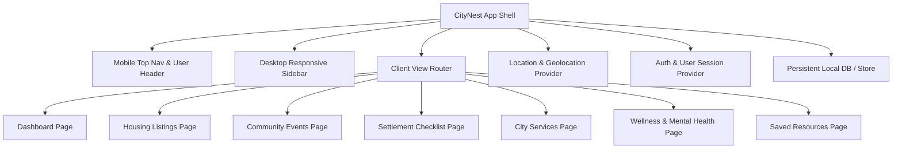

# CityNest — Implementation Plan

Build **CityNest**, a responsive, modern web application designed to help new city residents find housing, discover community events, navigate essential municipal services, track their settlement checklist, and access mental health and wellness resources.

## User Review Required
> [!IMPORTANT]
> - **Technology Stack**: React 18 + Vite + Tailwind CSS + Lucide React + Framer Motion + Canvas Confetti + LocalStorage/IndexedDB persistent database engine.
> - **Location Feature**: Browser Geolocation API with Haversine distance calculations in real-time, permission banner with 4 states (idle, loading, granted, denied), plus simulated NYC coordinates selector for easy testing without physical GPS movement.
> - **Multi-User Auth**: Email authentication + one-click demo user switching (e.g., Alex Chen, Sarah Miller) to demonstrate private saved resources and personal event RSVPs.

---

## Proposed Architecture & Components

---

## Proposed Changes

### Project Setup & Configuration
#### [NEW] [package.json](file:///c:/Users/Madhu/OneDrive/Attachments/New%20folder/package.json)
- React 18, Vite, Tailwind CSS, PostCSS, Autoprefixer, Lucide React, Framer Motion, Canvas Confetti, date-fns.

#### [NEW] [tailwind.config.js](file:///c:/Users/Madhu/OneDrive/Attachments/New%20folder/tailwind.config.js) & [postcss.config.js](file:///c:/Users/Madhu/OneDrive/Attachments/New%20folder/postcss.config.js)
- Warm color palette: Primary Blue (`#1E40AF` / `#2563EB` / `#3B82F6`), Secondary Green (`#059669` / `#10B981`), Accent Amber (`#D97706` / `#F59E0B`), warm neutrals (`#F8FAFC`, `#F1F5F9`, `#0F172A`).
- Custom shadows, glassmorphism utilities, Inter typography.

#### [NEW] [vite.config.js](file:///c:/Users/Madhu/OneDrive/Attachments/New%20folder/vite.config.js) & [index.html](file:///c:/Users/Madhu/OneDrive/Attachments/New%20folder/index.html)
- SEO tags, Inter Google font, CityNest favicon, viewport and metadata.

---

### Data Models & Services
#### [NEW] [src/types/index.ts](file:///c:/Users/Madhu/OneDrive/Attachments/New%20folder/src/types/index.ts)
- TypeScript interfaces for `HousingListing`, `CommunityEvent`, `ChecklistItem`, `SavedResource`, `User`, `LocationState`, `CityServiceCategory`, and `WellnessResource`.

#### [NEW] [src/services/db.ts](file:///c:/Users/Madhu/OneDrive/Attachments/New%20folder/src/services/db.ts)
- Persistent database manager with initial seed data:
  - 8 realistic NYC housing listings with coordinates (Manhattan, Brooklyn, Queens, Astoria, Williamsburg, etc.), amenities, photos, price, bedrooms, contact emails.
  - 8 community events across all 6 categories (social, sports, cultural, professional, volunteer, wellness) with upcoming dates, attendee counts, venues.
  - 10 starter checklist items across housing, utilities, healthcare, transport, finance, legal, and social with due dates and priority tags.
  - 6 City Service categories with 3 detailed guides each (18 comprehensive guides total).
  - 6 Wellness categories with 3 detailed actionable guides each + daily affirmation generator.
  - CRUD helper methods with persistence to `localStorage`.

#### [NEW] [src/utils/geo.ts](file:///c:/Users/Madhu/OneDrive/Attachments/New%20folder/src/utils/geo.ts)
- Haversine distance formula: computes km between user coords and item coords.
- Distance formatter: `"320 m away"` (when < 1 km) or `"1.4 km away"`.
- Default preset city coordinates (New York City landmarks: Times Square, Brooklyn Bridge, Central Park, Williamsburg) for instant location emulation.

---

### Context Providers & Hooks
#### [NEW] [src/context/AuthContext.tsx](file:///c:/Users/Madhu/OneDrive/Attachments/New%20folder/src/context/AuthContext.tsx)
- User session state, login, register, logout, demo user switcher, avatar generator.

#### [NEW] [src/context/LocationContext.tsx](file:///c:/Users/Madhu/OneDrive/Attachments/New%20folder/src/context/LocationContext.tsx)
- Geolocation API state handling: `idle`, `loading`, `granted`, `denied`.
- Distance calculation helper, manual coordinate override, preset city selection.

---

### UI Components & Navigation
#### [NEW] [src/components/layout/Sidebar.tsx](file:///c:/Users/Madhu/OneDrive/Attachments/New%20folder/src/components/layout/Sidebar.tsx)
- Desktop sleek sidebar with brand logo, active page links, badges (e.g., pending tasks, saved items count), user profile widget, quick location status indicator.

#### [NEW] [src/components/layout/MobileNav.tsx](file:///c:/Users/Madhu/OneDrive/Attachments/New%20folder/src/components/layout/MobileNav.tsx)
- Sticky mobile header with drawer navigation, search shortcut, and user badge.

#### [NEW] [src/components/common/LocationBanner.tsx](file:///c:/Users/Madhu/OneDrive/Attachments/New%20folder/src/components/common/LocationBanner.tsx)
- Interactive banner with the 4 required states:
  - **Granted**: Green badge, current coordinates/neighborhood, distance active indicator.
  - **Loading**: Pulse spinner and geolocating text.
  - **Denied/Unavailable**: Amber warning, retry button, and quick preset location picker.
  - **Idle**: Blue prompt with "Enable Location" button.

#### [NEW] [src/components/common/AuthModal.tsx](file:///c:/Users/Madhu/OneDrive/Attachments/New%20folder/src/components/common/AuthModal.tsx)
- Seamless sign-in / sign-up and fast 1-click demo user switch.

#### [NEW] [src/components/common/SaveNotesModal.tsx](file:///c:/Users/Madhu/OneDrive/Attachments/New%20folder/src/components/common/SaveNotesModal.tsx)
- Modal allowing users to attach personal notes when bookmarking housing, events, services, or wellness articles.

---

### Pages Implementation
#### [NEW] [src/pages/Dashboard.tsx](file:///c:/Users/Madhu/OneDrive/Attachments/New%20folder/src/pages/Dashboard.tsx)
- Time-of-day personalized greeting (`Good morning / afternoon / evening, [User]`).
- 6 quick-action cards with icons, gradients, and subtext linking directly to all sections.
- Settlement progress widget: visual circular/linear progress bar, % complete, top 3 pending checklist items with quick check-off button.
- Upcoming events widget: next 3 future events with date chips, category tags, distance badges, and RSVP indicators.
- Quick housing preview & city readiness summary cards.

#### [NEW] [src/pages/Housing.tsx](file:///c:/Users/Madhu/OneDrive/Attachments/New%20folder/src/pages/Housing.tsx)
- Location banner at top.
- Search input (title, neighborhood, address), property type filter pills (All, Apartment, Studio, Shared, House), price range slider, bedroom selector.
- Sort dropdown: Distance (default), Price (Low-High / High-Low), Bedrooms, Date.
- Interactive housing cards with image gallery carousel, type badge, distance badge, bookmark toggle, amenity tags, contact agent email modal, and detailed modal sheet.
- Empty states and animated transitions.

#### [NEW] [src/pages/Events.tsx](file:///c:/Users/Madhu/OneDrive/Attachments/New%20folder/src/pages/Events.tsx)
- Location banner.
- Category filter tabs: All, Social, Sports, Cultural, Professional, Volunteer, Wellness.
- Search and sorting (Distance default, Date upcoming).
- Event cards with high-res photos, category tags, calendar chips, venue & distance badges, attendee capacity progress bar ("X / Y spots filled"), and RSVP button (adds/removes user, disables when full).
- Bookmark toggle saving to `saved_resources`.
- Event details modal with Add-to-Calendar and directions.

#### [NEW] [src/pages/Checklist.tsx](file:///c:/Users/Madhu/OneDrive/Attachments/New%20folder/src/pages/Checklist.tsx)
- Visual settlement progress bar & completed vs total count.
- Filter pills: All, Completed, Pending, and Category pills (Housing, Utilities, Healthcare, Transport, Finance, Social, Legal).
- "Add Task" modal/form with title, description, category, priority (High, Medium, Low), and due days.
- Animated task cards with interactive check-off, category chips, priority badges, delete/edit actions, and celebratory confetti on completing all items.

#### [NEW] [src/pages/CityServices.tsx](file:///c:/Users/Madhu/OneDrive/Attachments/New%20folder/src/pages/CityServices.tsx)
- 6 Essential Categories accordion (Transportation, Utilities, Healthcare, Legal & ID, Education, Finance).
- Each category expands to reveal 3 structured guide items with step-by-step instructions, official portal links, helpline numbers, and "Save to My Resources" button.
- Quick search filter to quickly find any service guide.

#### [NEW] [src/pages/Wellness.tsx](file:///c:/Users/Madhu/OneDrive/Attachments/New%20folder/src/pages/Wellness.tsx)
- Daily affirmation card with refresh/shuffle button and save affirmation option.
- 6 Wellness Resource cards (Crisis Hotlines, Managing Stress, Building Connections, Self-Care Basics, Professional Help, Know Your Rights), each with 3 comprehensive expandable guides.
- Quick hotline direct dial / copy links and "Save Resource" action.

#### [NEW] [src/pages/Saved.tsx](file:///c:/Users/Madhu/OneDrive/Attachments/New%20folder/src/pages/Saved.tsx)
- Tabbed/filtered view of current user's saved resources (All, Housing, Events, Services, Wellness Articles).
- Color-coded badges, type icons, custom user notes (editable inline), direct links to source item, and delete button.
- Private to the authenticated user.
- Empty state with quick discovery buttons.

---

## Verification Plan

### Automated Verification
- Project builds cleanly with `npm run build` with zero TypeScript or bundling errors.
- Test script verifying the Haversine distance calculator and seed data integrity.

### Browser & Interactive Verification
- Start local Vite dev server and open in browser.
- **Location Test**:
  - Test initial banner state.
  - Click "Enable Location" (or select preset NYC coordinates) and verify distance badges display formatted distances like "450 m away" / "2.3 km away".
  - Verify listings and events sort by proximity by default.
- **Housing Test**:
  - Search, filter by apartment/studio/price, bookmark a listing, verify bookmark appears in Saved page.
- **Events Test**:
  - Filter by category, RSVP to an event, verify attendee count increments and button changes to "Cancel RSVP", check capacity limits.
- **Checklist Test**:
  - Check off items, verify progress bar updates dynamically, add a new custom task, filter by category.
- **Services & Wellness Test**:
  - Expand accordion categories, verify guide items, save a guide to Saved resources.
- **Saved & Auth Test**:
  - Switch users and verify saved items are isolated per user.
